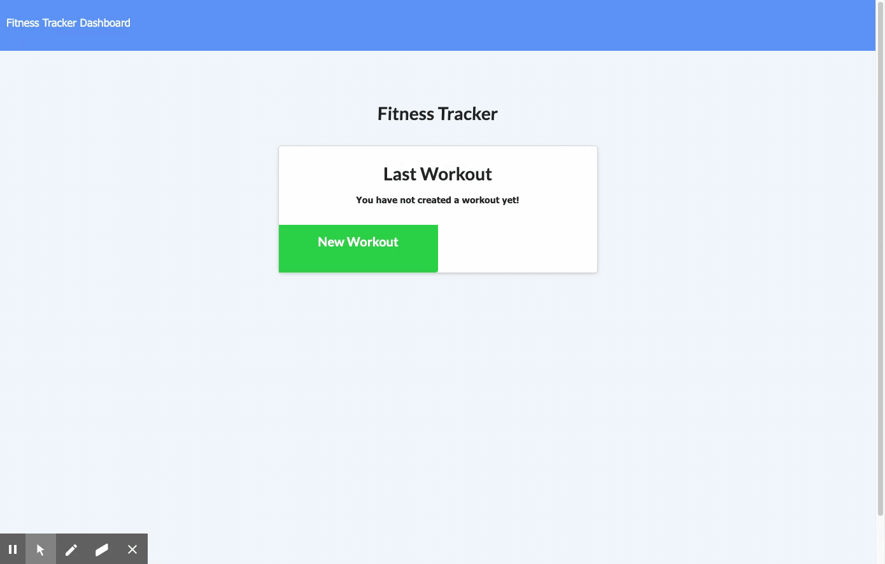

# Fitness-Tracker NoSQL Homework: Workout Tracker

For this assignment, you'll create a workout tracker. You have already been provided with the front end code in the `Develop` folder. This assignment will require you to create Mongo database with a Mongoose schema and handle routes with Express.

## User Story

* As a user, I want to be able to view create and track daily workouts. I want to be able to log multiple exercises in a workout on a given day. I should also be able to track the name, type, weight, sets, reps, and duration of exercise. If the exercise is a cardio exercise, I should be able to track my distance traveled.

## Business Context

A consumer will reach their fitness goals more quickly when they track their workout progress.


For users that need to keep track of a lot of information, it's easy to forget or be unable to recall something important. Being able to take persistent notes allows users to have written information available when needed.

## Screenshots
The following animation demonstrates the application functionality:



## CLICK THE ICON BELOW: VIDEO DEMO LINK

[![VIDEO LINK]](https://drive.google.com/file/d/1gYknKURS4EAE53pmNLEFyCRRwJJjcTAT/view)

## INSTALLATION

*Steps required to install project and how to get the development environment running:*

App is deployed to Heroku here: https://dashboard.heroku.com/apps/floating-plateau-83723. Deployed app is: https://floating-plateau-83723.herokuapp.com/
If choosing to use from terminal, open terminal and run    
```npm install```   
```npm run seed```   
```npm start```   


Then in browser, search 
```localhost:3001``` 
You can run the app by running  `node server.js` in the terminal.

## Acceptance Criteria

When the user loads the page, they should be given the option to create a new workout or continue with their last workout.

The user should be able to:

  * Add exercises to the most recent workout plan.

  * Add new exercises to a new workout plan.

  * View the combined weight of multiple exercises from the past seven workouts on the `stats` page.

  * View the total duration of each workout from the past seven workouts on the `stats` page.

## GitHub Repository & Deployed Site
*GitHub: [@danielthomas129](https://danielthomas129.github.io/Fitness-Tracker/)
*[Github-Repository](https://github.com/danielthomas129/Fitness-Tracker)
*Heroku: [Heroku-Deployed-App](https://floating-plateau-83723.herokuapp.com/)
.*Heroku: [Heroku-Site=Dashboard](https://dashboard.heroku.com/apps/floating-plateau-83723)
- - -

### Daniel Thomas Guadalupe
  
  ## Questions?
  
   
  
  For any questions, please contact me with the information below:
 
  GitHub: [@danielthomas129](https://api.github.com/users/danielthomas129)
  
© 2020 Trilogy Education Services, a 2U, Inc. brand. All Rights Reserved.


